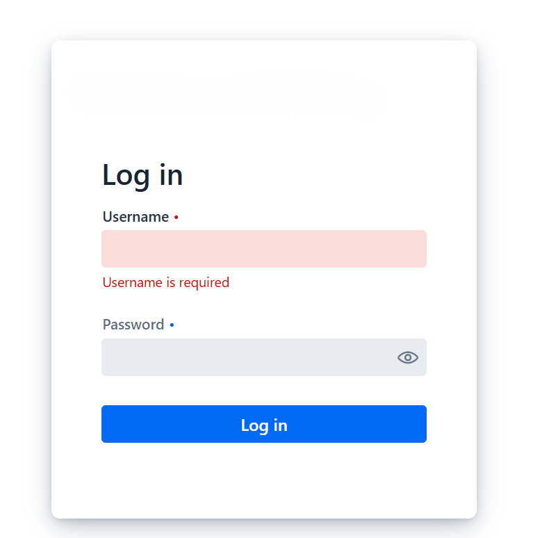

# Functional and UI Test Cases: WeatherApp

| ID | Feature | Priority | Test Steps | Expected Result | Status | Actual Result |
|:---|:---|:---|:---|:---|:---|:---|
| 1 | Success Login | Critical | 1. Open App. 2. Enter valid credentials. 3. Click Log in. | User is logged in and redirected to dashboard. | **Pass** | Logged in successfully. |
| 2 | Failed Login | High | 1. Enter invalid credentials. 2. Click Log in. | "Invalid credentials" error message in red. | **Fail** | Shows "username is required" instead of auth error.  |
| 3 | Empty Login | Medium | 1. Leave fields empty. 2. Click Log in. | "Field is required" validation messages. | **Pass** | Correct validation displayed. |
| 4 | Security: Spec. Chars | Medium | 1. Enter `ĄĖĘ ; #$%^&` in login. | System handles/sanitizes input. | **Fail** | Generic required field error; no sanitization check. |
| 5 | Logout | Medium | 1. Log in. 2. Click Logout. 3. Access `/home`. | Session is destroyed; access denied. | **Pass** | Successfully logged out. |
| 6 | Session Persistence | Medium | 1. Log in. 2. Close and re-open tab. | User remains logged in. | **Pass** | Session data saved correctly. |
| 7 | "Remember Me" | High | 1. Check for "Remember Me" option. | Feature should be available in UI. | **Fail** | Feature is missing from the login form. |
| 8 | Success Search | Critical | 1. Search for a valid city (e.g., Vilnius). | System returns correct location data. | **Pass** | First result matches input. |
| 9 | Failed Search | High | 1. Search for `123456` or `%^$#`. | "No results found" or empty state. | **Pass** | No results returned as expected. |
| 10 | Autocomplete | Critical | 1. Type city name partial. | System suggests matching locations. | **Pass** | Multiple suggestions provided. |
| 11 | Case Sensitivity | Medium | 1. Search `kaunas` vs `KAUNAS`. | Consistent results regardless of casing. | **Pass** | Case sensitivity handled correctly. |
| 12 | Search Logic | High | 1. Search for specific cities (e.g., Florence). | Only relevant matches shown. | **Fail** | Returns unrelated global locations (clutter). |
| 13 | Result Filtering | Medium | 1. Use the filter field on results. | Filter by Country/City name. | **Fail** | Filter only works by text; no criteria selection. |
| 14 | Sorting (Single) | Medium | 1. Click arrows on Name/Country. | Results sorted A-Z or Z-A. | **Pass** | Alphabetical sorting works. |
| 15 | Sorting (Multi) | Medium | 1. Sort by Country then Name. | Multi-level sorting applied. | **Pass** | Works as expected. |
| 16 | Sorting (Reverse) | Medium | 1. Sort Z-A. | Results reversed correctly. | **Pass** | Works as expected. |
| 17 | Reset Action | Medium | 1. Apply sort/filter. 2. Click Reset. | Option to return to default view. | **Fail** | No "Reset/Clear" button available. |
| 18 | Bookmarking | High | 1. Click bookmark icon on city. | City added to Favorites sidebar. | **Pass** | Added correctly. |
| 19 | Guest Bookmarking | High | 1. Bookmark without login. | Prompt to login or feature disabled. | **Fail** | Icon visible but doesn't function for guests. |
| 20 | Remove Bookmark | Medium | 1. Click "X" on favorite. | Item removed; list updates. | **Fail** | List updates only after manual refresh. |
| 21 | UI: Highlighting | High | 1. Check city name on Dashboard. | City name is prominent/highlighted. | **Hold** | Name is in the corner; hard for users to notice. |
| 22 | Weekly Forecast | High | 1. Compare data with Google. | Temperature matches (small margin). | **Hold** | Night temps vary significantly vs trusted sources. |
| 23 | Sunrise/Sunset | High | 1. Compare times with external source. | Accurate times for current location. | **Hold** | 1-2 min error; NY doesn't account for local time zone. |
| 24 | UV Index | High | 1. Check UV index unit. | Scale 0-11 used. | **Fail** | Shows % (e.g., 0.65%) instead of index scale. |
| 25 | Precipitation | High | 1. Compare % with external source. | Accurate precipitation data. | **Fail** | Large discrepancies (100% vs 25%). |
| 26 | Hourly Graph | High | 1. Check hourly temp change. | Graph reflects real-time changes. | **Hold** | Small discrepancies; time zone issues. |
| 27 | Data Consistency | High | 1. Compare Dashboard vs Chart. | Data matches across sections. | **Pass** | Charts match internal data. |
| 28 | Chart Sorting | Medium | 1. Sort 24h data. | Sorting works within chart list. | **Pass** | Functional as expected. |
| 29 | Unit Support | Medium | 1. Look for Imperial units (F, mph). | Option to switch from Metric. | **Fail** | Only Metric (C, km/h) supported. |
| 30 | Weather Icons | Medium | 1. Compare icons with data. | Icons reflect weather (Sunny/Rain). | **Fail** | Sunny icon displayed during rainy data. |
| 31 | Geo (Allowed) | Critical | 1. Grant location permission. | Detects city name automatically. | **Hold** | Permission asks, but label stays blank. |
| 32 | Geo (Revoke) | Critical | 1. Revoke via UI. | In-app option to stop sharing. | **Fail** | No UI option; must use browser settings. |
| 33 | Geo (Denied) | Critical | 1. Deny permission. | Error message shown. | **Fail** | Error shown as unstyled plain text. |
