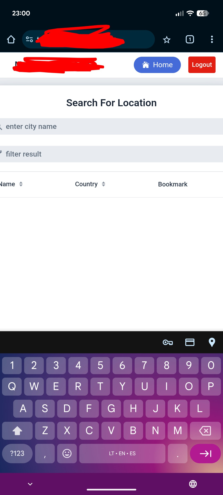
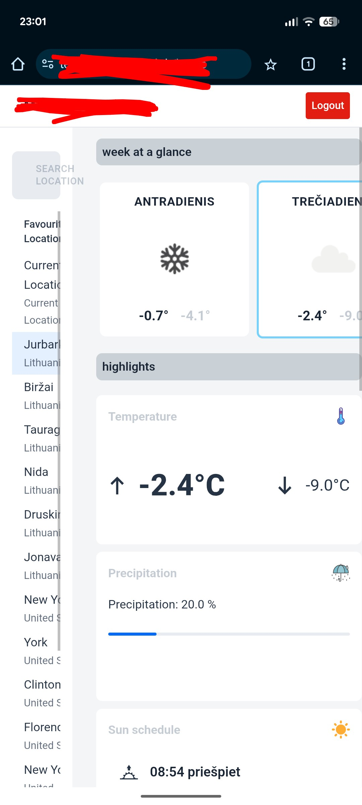
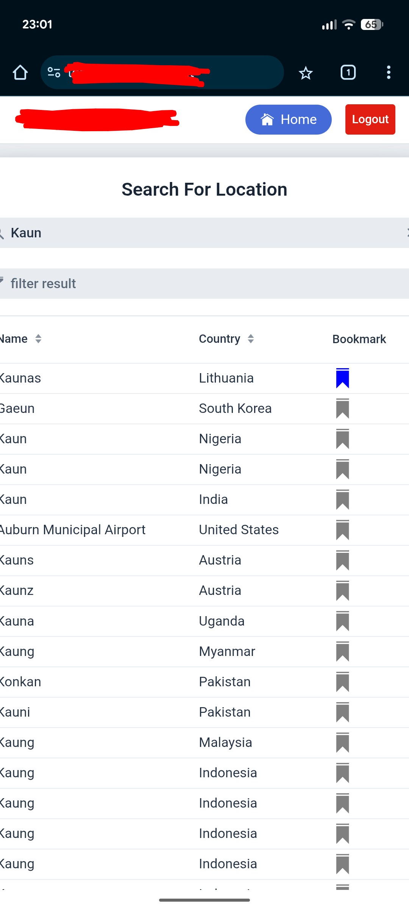
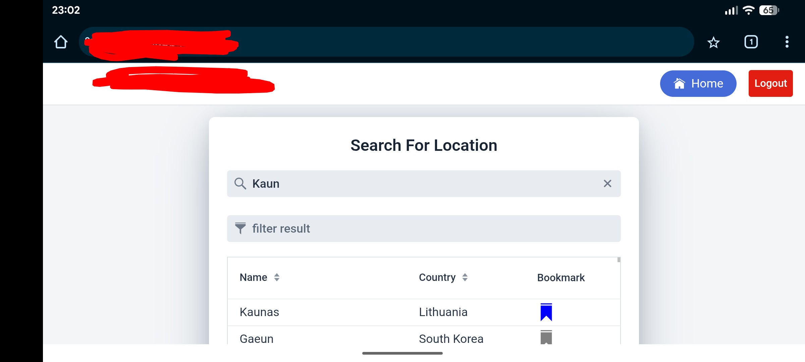
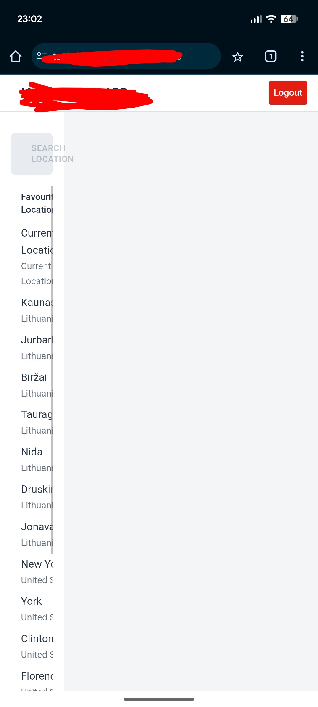
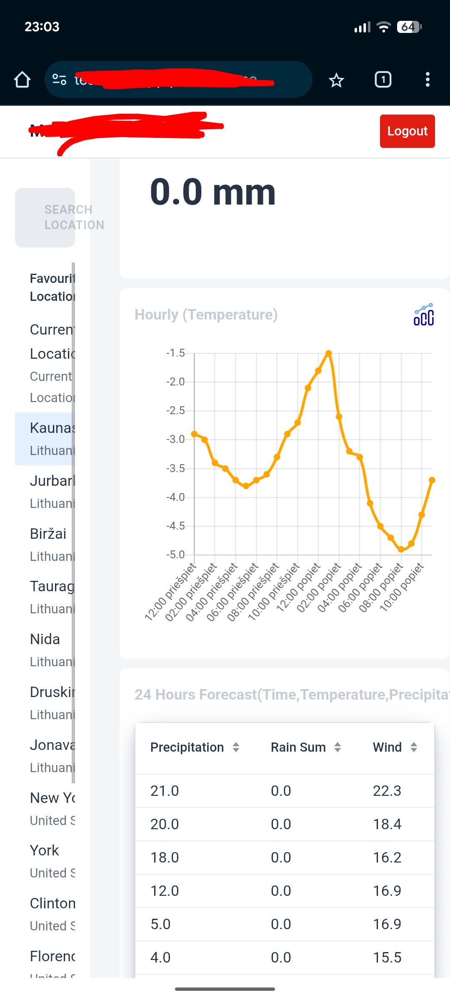

# Mobile Compatibility Test Cases (Google Pixel 6, Google Chrome)

| ID | Feature | Priority | Test Steps | Expected Result | Status |
|:---|:---|:---|:---|:---|:---|
| M1 | Hamburger Menu | High | 1. Open app on Pixel 6. 2. Tap the menu icon. | Menu doesn't expand smoothly without overlapping search. | **Fail** |
| M2 | Search Bar Focus | High | 1. Tap the search bar. 2. Start typing. | Keyboard appears; "Search" button remains visible or accessible.  | **Fail** |
| M3 | Mobile Layout | Medium | 1. View weekly forecast on mobile. | Columns stack vertically; no horizontal scrolling needed.  | **Fail** |
| M4 | Touch Targets | Medium | 1. Try to click "Bookmark" icon. | Icons are large enough for thumb interaction (min 44x44px).  | **Pass** |
| M5 | Orientation | Low | 1. Rotate device to Landscape mode. | Layout adjusts correctly without breaking UI. | **Pass** |
| M6 | Pull-to-Refresh | Medium | 1. Navigate to the main dashboard. 2. Swipe down from the top of the screen. | The app triggers a data refresh or page reload.  | **Fail** |
| M7 | Chart Responsiveness | High | 1. Open the 24-hour hourly temperature chart. 2. Attempt to scroll horizontally. | The chart is fully accessible, scales to width, or allows smooth horizontal scrolling without breaking the layout.  | **Pass** |
| M8 | Visual Fidelity (DPI) | Low | 1. Inspect weather icons and UI elements on the high-resolution Pixel 6 screen. | Icons and assets appear sharp and clear (no pixelation or blurriness). | **Pass** |
